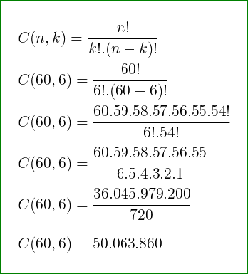

# Lotek Lock (lotek-lock)

Se trata de um projeto prático prova de conceito POC para deixar pegadas digitais e ser próativo para os processos seletivos onde as equipes técnicas de recrutadores tenham condições e evidências para verificar se o meu perfil pode atender as necessidades das oportunidades.

## <span style="color:red !important; background-color:yellow !important;">IMPORTANTE</span>

Não se seja ingênuo e tenha em mente o vídeo opinativo: [Loterias são literalmente uma farsa](https://youtu.be/cLWR0d0C13A?si=aiAxv3RVsD5UIggx). E use o seu senso crítco e formente a sua opnição! 

O divertido aqui é desenvolver as [proficiências](#proficiências) na prática.

## Visão do Projeto

Objetivo de Implementar várias versões usando Refatorção de algoritmos de processamento paralelo / concorrente clusterizado que possibilite gera todos os resultados da Mega Sena e que seja possível aplicar a analisar estatisticamente os resultados da fórmula de análise combinatória! 

Todos os resultados são mais de 50 milhões de combinações: 50.063.860

## Fórmula Análise Combinatória



--- 

## Proficiências

Procuro evidência as proficiências nas seguintes habilidades técnicas:

- Técnicas em [Análise Código-fonte Legados](#FEATHERS-michael);
- Técnicas em [Refatoração Código-fonte Legados](#FEATHERS-michael);
- Implementar Soluções usando algoritmos Reutilizáveis usando:
  - Processamento Paralelo e Concorrente:
    - Nativo em Java SE e EE
    - Framework Spring Batch;
- Multiplas Arquiteturas
  - Event Source
  - CQRS
- Implementar Multiplas Filas de Mesageria:
  - RabbitMQ
  - Kafka
  - ActiveMQ
- Implantação de Soluções [Sem Servidores em multipla nuvens]();
- [Angular Framework](https://angular.io/);

Projeto inicializado com o [`Scripts de automação próprio`]().

## 🚀 Começando

### 📋 Pré-requisitos

De que coisas precisamos para instalar o software e como instalá-lo?

```bash
##############################################
# Instalação do NodeJS no Fedora
##############################################
sudo dnf install nodejs.x86_64
node -v
##############################################

##############################################
# Instalação do Node Version Manager no Fedora
##############################################
export NVM_VERSION="v0.39.3"

curl -o- "https://raw.githubusercontent.com/nvm-sh/nvm/${NVM_VERSION}/install.sh" | bash

nvm -v
nvm install --lts

##############################################

##############################################
# Instalação Typescript, Angular 
##############################################
export NG_CLI_VERSION="17.3.3"
npm install -g typescript "@angular/cli@${NG_CLI_VERSION}"
##############################################

```

### 🔧 Instalação

Para obter o presente projeto use os seguintes comandos:

```bash
mkdir -p "${HOME}/projetos"
cd "${HOME}/projetos"
git clone https://github.com/pssilva/lotek-luck.git
cd lotek-luck
code .
```

Em um terminal execute a aplicação com os seguintes comandos:

```bash
cd "${HOME}/projetos/lotek-luck"

```

## Implantar no Heroku

A maneira mais fácil de implantar seu aplicativo é usar a [Plataforma do Heroku](https://devcenter.heroku.com/start) dos criadores dos princípios: [Os Doze Fatores (The Twelve-Factor App)](https://12factor.net/pt_br/).

Confira [documentação de implantação do Heroku](https://devcenter.heroku.com/start) para mais detalhes.

---

## 🔩 Débitos Técnicos

Aqui temos uma lista do que idenficamos com status de pendente:

### Funcionalidades Aplicação

Segue abaixo (não se limita) os objetivos do presente projeto:

- [X] ~~Formatando documentação README.md~~
- [X] ~~Indexação completa do vídeo longo: [VIDEO LONGO 5245 – 03.04.07.18.02.41.03 – O que você deveria saber sobre Spring Batch? – Questões](docs/indexacoes/VIDEO%20LONGO%205245%20–%2003.04.07.18.02.41.03%20–%20O%20que%20você%20deveria%20saber%20sobre%20Spring%20Batch?%20–%20Questões.pdf)~~ (mais detalhes veja [aqui](docs/indexacoes/README.md))
- [X] ~~Indexação completa da playlist: [PLAYLIST 58 vídeos – 03.04.07.12.09 – CRUD Angular + Spring – Questões](docs/indexacoes/PLAYLIST%2058%20vídeos%20–%2003.04.07.12.09%20–%20CRUD%20Angular%20+%20Spring%20–%20Questões.pdf)~~ (mais detalhes veja [aqui](docs/indexacoes/README.md))
- [X] Indexação completa da Playlist: [PLAYLIST 19 VIDEOS – 03.04.07.18.06 – Curso Multithread, Paralelismo e Concorrência com Java – RinaldoDev – Questões](docs/indexacoes/PLAYLIST%2019%20VIDEOS%20–%2003.04.07.18.06%20–%20Curso%20Multithread,%20Paralelismo%20e%20Concorrência%20com%20Java%20–%20RinaldoDev%20–%20Questões.pdf) (mais detalhes veja [aqui](docs/indexacoes/README.md))
- [ ] Modeloagem 
- [ ] Descrição sucinta da tarefa a ser feita aqui ......
- [ ] Descrição sucinta [TRABALHO EM PROGRESSO]

### Atividades - DevOps

- [ ] Implementação dos Pipelines CI/CD de Implatação num Provedor de Nuvem (mais detalhes veja [aqui](docs/provedores_nuvem/README.md)).
- [ ] Implementar restrições de Commit no Git: vinculado com o ID de regra de negócio e ID do checklist de validação das entragas de funcionalidades (mais detalhes [aqui](docs/checklists/README.md))
- [ ] Implementar Dockerfiles para Kubernetes
- [ ] Colocar em prática o Desenvolvimento Orientado a Interface onde se deve desacoplar a aplicação do procedor de nuvem (Princípio da Segregação de Interface (ISP) - SOLID) (mais detalhes veja [aqui](docs/provedores_nuvem/README.md))
- [ ] Implementar Arquitetura Orienta a Eventos ([EDA](https://aws.amazon.com/pt/what-is/eda/))

### Suporte / Sustentação

- [ ] Abordagem API First e Implementação da Especificação do [OpenAPI (antido Swagger)](https://swagger.io/specification/) para integração com o back-end
- [ ] Clusterização da Solução em Diversas [VM em multicloud Nuvem]() para integração com o back-end

### Segurança

- [ ] Aplicar o checklist (veja [aqui](docs/checklists/README.md)) das [vulnerabilidades mais recorrentes (Top 10 OWASP (Open Web Application Security Project))](https://owasp.org/Top10/) nas dependências usadas na solução
- [ ] implementar pentests para [vulnerabilidades Top 10 OWASP](https://owasp.org/Top10/)
- [ ] [Spring Boot externalized configuration](https://docs.spring.io/spring-boot/reference/features/external-config.html): Externalização das configurações dos parâmetros de uma aplicação
- [ ] Aplicar os checklists  

---

## 📦 Desenvolvimento

- [ ] Inplementar o gernciador de tarefas Gruntfile.js

### Mentalidade PDCA

Tendo em mente que sempre buscamos melhorar o protocolo de trabalho operacinal do dia a dia usando empirismo (colocar realmente em prática os conheicmentos abstratos):


---

## 🛠️ Construído com

Seque aqui as ferramentas utilizadas na construção presente projeto:

### Front-end

* [Angular](https://pt-br.legacy.Angularjs.org/)
* [Node.js](https://nodejs.org/en/)
* [Typescript](https://www.typescriptlang.org/docs/)

### Back-end

* [Spring Boot]()
* [Spring Batch]()

### Ferramentas

* [Docker](https://www.docker.com/get-started/)
* [NVM](https://github.com/nvm-sh/nvm?tab=readme-ov-file#intro) - Node Version Manager
* [Terminal Shell Linux (WSL)](https://learn.microsoft.com/pt-br/windows/wsl/install)


## 🖇️ Colaborando

Por favor, leia o [COLABORACAO.md](COLABORACAO.md) para obter detalhes sobre o nosso código de conduta e o processo para nos enviar pedidos de solicitação.

## 📌 Versão

Nós usamos [SemVer](http://semver.org/) para controle de versão. Para as versões disponíveis, observe as [tags neste repositório](https://github.com/suas/tags/do/projeto).

## ✒️ Autores

Mencione todos aqueles que ajudaram a levantar o projeto desde o seu início

* **Um desenvolvedor** - *Trabalho Inicial* - [pssilva](https://github.com/pssilva)


Você também pode ver a lista de todos os [colaboradores](COLABORACAO.md) que participaram deste projeto.

---

## 📄 Licença

Este projeto está sob a licença (sua licença) - veja o arquivo [LICENSE](LICENSE) para detalhes.

---

## 🎁 Expressões de Gratidão

  Primeiro confesso aqui publicamente a minha gratidão ao Criado! E reconheço Jesus Cristo como o meu Senhor e Salvador! E que tudo é para honra e glória do Altissímo! Amém!! 📢

  Expresso gratidão pelas contribuções para comunidade aos seguintes Canais do Youtube:

- [Devs JavaGirl BR (@DevsJavaGirlBR)](https://www.youtube.com/@DevsJavaGirlBR)
- [Giuliana Bezerra (@giulianabezerra)](https://www.youtube.com/@giulianabezerra)
- [Fernanda Kipper | Dev (@kipperdev)](https://www.youtube.com/@kipperdev)
- [Loiane Groner (@loianegroner)](https://www.youtube.com/@loianegroner)
- [RinaldoDev (@rinaldodev)](https://www.youtube.com/@rinaldodev)

---

## Referencias Usadas

Seque abaixo as referências bibliográficas usadas no presente projeto:

### Livros

---

<p align="justify">
GOODRICH, Michael T; TAMASSIA, Roberto. PROJETO DE ALGORITMOS: Fundamentos, análise e exemplos da Internet. 1 Ed. Cidade da publicação: Bookman; 1ª edição (25 março 2004), ©2002 John Wiley & Sons, Inc. 696 páginas. (Nome da série e/ou coleção, ISBN 978-85-7780-342-2). Disponível em: < <a href="https://a.co/d/3Co91c3">https://a.co/d/3Co91c3</a> >. Acesso em: 15 jun. 2024.
</p>

---

<p align="justify">
[<a id="FEATHERS-michael">MARTIN, Robert C. | FEATHERS Michael</a>]: Working Effectively with Legacy Code. Library of Congress Cataloging-in-Publication Data: 2004108115 Copyright © 2005 Pearson Education, Inc. Prentice Hall Professional Technical Reference Upper Saddle River, NJ 07458. ISBN 0-13-117705-2 (Robert C. Martin Series, número). Disponível em: < <a href="https://a.co/d/3RZL8Sl">https://a.co/d/3RZL8Sl</a> >. Acesso em: 16 Mai. 2024.
</p>

---

<p align="justify">
[<a id="GOETZ-Brian">GOETZ ,Brian; PEIERLS ,Tim; BLOCH, Joshua et al</a>]. Java Concurrency in Practice. 1 Ed. Addison-Wesley Professional; 1st edition (May 9, 2006). 432 pages. (Nome da série e/ou coleção, 978-0-321-34960-6). Disponível em: < <a href="https://a.co/d/4T05Xuz"> https://a.co/d/4T05Xuz </a> > . Acesso em: dia 12 jun. 2024.
</p>

---

<p align="justify">
<a id="Spring-Boot-and-Angular"></a>
[DULDULAO, Devlin Basilan, VILLAFRANCA], Seiji Ralph. [<a href="https://a.co/d/htReU6n">Spring Boot and Angular: Hands-on full stack web development with Java, Spring, and Angular</a>]. 1 Ed. Birmingham B3 2PB, UK.: Packt Publishing, Copyright © 2022. 438 p. (Nome da série e/ou coleção, ISBN 978-1-80324-321-4). Disponível em: < <a href="https://a.co/d/htReU6n">https://a.co/d/htReU6n</a> >. Acesso em: 29 mai.2024.
</p>

---

### Vídeos / Playlists

---

<p align="justify">
[<a id="O-QUE-VOCÊ-DEVERIA-SABER-SOBRE-SPRING-BATCH">O QUE VOCÊ DEVERIA SABER SOBRE SPRING BATCH?</a>] Direção: Vídeo de apresentação teórica de sistemas batch / spring batch. Produção: Feito pelo canal do youtube @DevsJavaGirlBR. Realização: Fito pelo canal do youtube @DevsJavaGirlBR. Roteiro: Feito pela Giuliana Bezerra (@giulianabezerra). Fotografia: N/A. Intérpretes: N/A. Local: Vídeo postado na plataforma do Youtuve, 29 de ago. de 2020.  Indicação do suporte físico e duração entre parênteses, demais características (stream, som, cor, legenda, tradução, stream). Disponível em: < <a href="https://www.youtube.com/live/ACaKKm00Tts?si=trRz0HB4EJXkjV7o"> https://www.youtube.com/live/ACaKKm00Tts?si=trRz0HB4EJXkjV7o </a> >. Acesso em: 8 jun. 2024
</p>

---

<p align="justify">
[<a id="CURSO-MULTITHREAD-Paralelismo-Concorrência-com-Java">CURSO MULTITHREAD, Paralelismo e Concorrência com Java.</a>] Direção: Reinaldo (@rinaldodev). Produção: Reinaldo (@rinaldodev). Realização: Reinaldo (@rinaldodev). Roteiro: Reinaldo (@rinaldodev). Fotografia: N/A. Intérpretes: N/A; Reinaldo (@rinaldodev). Local: Playlist produzida na plataforma do youtube, 22 de out. de 2020. Indicação do suporte físico e duração entre parênteses, demais características (tipo stream, som, cor, legenda, tradução, tipo stream). Disponível em: < <a href="https://youtube.com/playlist?list=PLuYctAHjg89YNXAXhgUt6ogMyPphlTVQG&si=dbt3IMMis_sXcCCP"> https://youtube.com/playlist?list=PLuYctAHjg89YNXAXhgUt6ogMyPphlTVQG&si=dbt3IMMis_sXcCCP</a> >. Acesso em: 3 jun. 2024.
</p>

---

<p align="justify">
[<a id="CRUD-ANGULAR-+-SPRING">CRUD ANGULAR + SPRING</a>]. Direção: Loiane Groner. Produção: Loiane Groner. Realização: Loiane Groner. Roteiro: Loiane Groner. Fotografia: N/A. Intérpretes: N/A; Loiane Groner. Local: Produzido no canal de stream Youtube,  5 de jul. de 2016 (há mais de 7 anos). Indicação do suporte físico e duração entre parênteses, demais características (tipo de sinal se vídeo, som, cor, legenda, tradução, tipo de película). Disponível em: <  <a href="https://www.youtube.com/playlist?list=PLGxZ4Rq3BOBpwaVgAPxTxhdX_TfSVlTcY">https://www.youtube.com/playlist?list=PLGxZ4Rq3BOBpwaVgAPxTxhdX_TfSVlTcY</a> >. Acesso em: 29 mai. 2024.
</p>

NOTA: para deixar evidenciado, segue a [indexação da playlist](./docs/indexacoes/README.md) (se trata de um questionário com o mapeamento do link de um tema / assunto no momemento onde se explica um conceito ou uma técnica de codificação).

---

<p align="justify">
[CURSO DE ANGULAR]. Direção: Loiane Groner. Produção: Loiane Groner. Realização: Loiane Groner. Roteiro: Loiane Groner. Fotografia: N/A. Intérpretes: N/A; Loiane Groner. Local: Produzido no canal de stream Youtube,  5 de jul. de 2016 (há mais de 7 anos). Indicação do suporte físico e duração entre parênteses, demais características (tipo de sinal se vídeo, som, cor, legenda, tradução, tipo de película). Disponível em: < https://youtube.com/playlist?list=PLGxZ4Rq3BOBoSRcKWEdQACbUCNWLczg2G&si=9ETFjwYZsV1ed7bU >. Acesso em: 29 mai. 2024.
</p>
